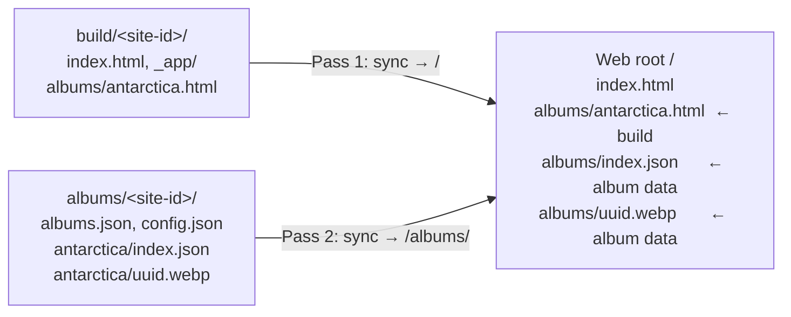
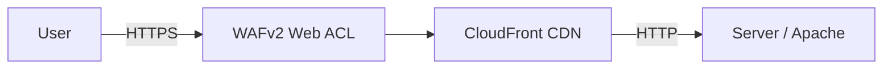
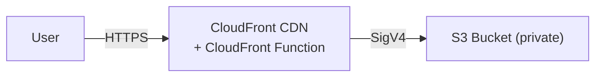

# DD Photos Development Notes

## Introduction

This page covers the technical details of DD Photos for developers and those
who want to understand how the pieces fit together. Topics include the SvelteKit
frontend, environment configuration, all Makefile targets, `photogen` CLI flags
and output layout, photo descriptions and sort order, encryption and password
protection, deployment, Apache/nginx routing, and development tips.

## SvelteKit

SvelteKit is two things bundled together:

- **Svelte** — a UI component framework (a React alternative). Components are written in `.svelte`
  files combining HTML, CSS, and JavaScript. Unlike React, Svelte compiles components to vanilla
  JavaScript at build time with no virtual DOM and no runtime library shipped to the browser.
- **Kit** — the application framework built on top of Svelte, analogous to Next.js for React.
  It adds file-based routing (via `src/routes/`), data loading (`+page.ts`), adapters for different
  deployment targets, and the build pipeline via Vite.

What SvelteKit specifically does for this project:

- **Routing** — `src/routes/albums/[slug]/[[index]]/` becomes `/albums/antarctica/1` automatically
- **Data loading** — `+page.ts` fetches `albums.json` and `index.json` before the page renders
- **Component reactivity** — lightbox state, theme toggle, image loading effects
- **Build pipeline** — Vite bundles everything; `adapter-static` pre-renders all routes to `.html` files.
  For encrypted builds, the SvelteKit crawler cannot discover album links hidden behind the password
  prompt, so `svelte.config.js` uses an `albumEntries()` function to read album slugs from
  `web/static/albums/` at build time and inject them into `prerender.entries` directly.
- **Client-side navigation** — clicking between albums swaps content without a full page reload

The site is a hybrid of static and dynamic rendering:

- **Static**: the HTML shell (nav, footer, page structure) is pre-built at deploy time and served
  as plain files — no server generates pages on request
- **Dynamic**: `albums.json` and `index.json` are fetched by JavaScript in the browser after load;
  the photo grid, lightbox, and navigation are all rendered client-side from that JSON data

The JSON files themselves are static files, but their content is rendered in the browser. This
pattern is called CSR (Client-Side Rendering) with a static shell — the shell is pre-built, but
the content is rendered by JavaScript in the browser rather than on a server.

## LAN Access

When running the dev server (`make web-npm-run-dev`), you should see a Vite message listing 
the URLs where the site is accessible, typically http://localhost:5173 and any local network 
IPs (useful for testing on your phone or tablet).

Another way to get the LAN IP is as follows (helpful if running Apache, which doesn't print
out IPs):

```bash
# macOS
ipconfig getifaddr en0 2>/dev/null || ipconfig getifaddr en1 2>/dev/null

# Linux
hostname -I | awk '{print $1}'
```

### HTTPS on the Dev Server

Password-protected albums use the [Web Crypto API](https://developer.mozilla.org/en-US/docs/Web/API/Web_Crypto_API)
(`crypto.subtle`), which browsers only expose in [secure contexts](https://developer.mozilla.org/en-US/docs/Web/Security/Secure_Contexts).
`localhost` qualifies, but a LAN IP address (e.g. `192.168.x.x`) over plain HTTP does not —
the password prompt will appear but decryption will silently fail.

To serve the dev server over HTTPS, set `VITE_HTTPS=1`:

```bash
VITE_HTTPS=1 make web-npm-run-dev        # or your own site-specific recipe
```

This loads `@vitejs/plugin-basic-ssl`, which generates a self-signed certificate automatically.
Your browser (and mobile browser) will show a certificate warning — click through
**Advanced → Proceed** once and the site works normally, including password decryption.

## Simulating Slow Image Loading

Album pages fade images in as they load. On a fast local connection this is
imperceptible. To simulate slow loading and see the effect, append `?slow` to
any album URL:

```
http://localhost:5173/albums/your-album?slow
```

Each image's `src` is assigned after a random 500–2500ms delay, triggering a
real browser load cycle rather than just a visual trick. Works on production too:

```
https://photos.example.com/albums/your-album?slow
```

## Logging Dev Server Requests

To see each request to the dev server (useful in debugging) set `VITE_LOG_REQUESTS=1`:

```bash
VITE_LOG_REQUESTS=1 make sample-npm-run-dev
```

## Debugging

To enable the `debug` library, where `debug()` calls are logged in the JavaScript
console, and also logged in the dev server, set `VITE_DEBUG=1`:

```bash
VITE_DEBUG=1 make sample-npm-run-dev
```

Usage examples:

```ts
import { debug } from '$lib/debug';

// Simple message
debug("I'm here")

// Pretty-print an object as JSON
const siteConfig: SiteConfig = await res.json();
debug('siteConfig', siteConfig);

// Avoid SvelteKit warnings about state
let { data } = $props();
$effect(() => { debug("In home page svelte, got $props()", data) });
```

## Environment Variables

### Site Identity (`albums.yaml`)

Site identity settings live in the `settings:` block of `albums.yaml` and are written
into either `config.json` or `html.json` by `photogen`. The frontend reads them at 
runtime via `fetch('/albums/[config|html].json')` — no build-time injection needed.

| Setting              | Required | Description                                                                                                                                              |
|----------------------|----------|----------------------------------------------------------------------------------------------------------------------------------------------------------|
| `site_name`          | yes      | Site title shown in the browser tab and OG tags                                                                                                          |
| `site_url`           | yes      | Canonical base URL (e.g. `https://photos.example.com`); used in sitemap and OG tags                                                                      |
| `site_description`   | yes      | Meta description and OG description for the home page                                                                                                    |
| `copyright_owner`    | yes      | Name shown in the footer copyright line                                                                                                                  |
| `copyright_year`     | yes      | Start year shown in the footer copyright line                                                                                                            |
| `allow_crawling`     | no       | Set to `true` to allow search engine crawling; adds `Sitemap:` to `robots.txt` (default: `false`)                                                        |
| `site_title_html`    | no       | HTML for the site title on the home page; falls back to `site_name` when omitted. Allows links, emphasis, etc. Written to `html.json` / `html.enc.json`. |
| `site_subtitle_html` | no       | HTML rendered below the site title in a smaller font. Written to `html.json` / `html.enc.json`.                                                          |
| `site_overview_html` | no       | HTML rendered above the album cards (slightly larger than album descriptions). Written to `html.json` / `html.enc.json`.                                 |

`photogen`'s `Config.Validate()` enforces all required fields before any files are written.

### Deploy and Test Variables (`site.env`)

The `site.env` file holds variables used only by deployment scripts and tests — nothing
that affects the built site itself.

| Variable            | Used by                     | Description                                                           |
|---------------------|-----------------------------|-----------------------------------------------------------------------|
| `CLOUDFRONT_ID`     | `bin/deploy-photos.sh`      | CloudFront distribution ID; if set, cache is invalidated after deploy |
| `S3_BUCKET`         | `bin/deploy-photos.sh`      | S3 bucket name for deployment (S3 mode only; requires `--s3`)         |
| `RSYNC_DEST`        | `bin/deploy-photos.sh`      | Rsync destination path on the server (rsync mode only)                |
| `TEST_ALBUM_LOCAL`  | `bin/test-photos-server.sh` | Album slug used for local server tests                                |
| `TEST_ALBUM_PROD`   | `bin/test-photos-server.sh` | Album slug used for production tests                                  |
| `TEST_ALBUM_HYPHEN` | `bin/test-photos-server.sh` | Album slug with a hyphen (tests URL routing edge case)                |

The `bin` scripts `source` this file directly.

### Album Location Variables

Two variables tell the dev server, build, and Docker container where to find album data:

| Variable              | Default  | Description                                                                                                                     |
|-----------------------|----------|---------------------------------------------------------------------------------------------------------------------------------|
| `DDPHOTOS_ALBUMS_DIR` | `albums` | Path to the root albums directory (absolute or repo-root-relative)                                                              |
| `DDPHOTOS_SITE_ID`    | `sample` | Site ID — selects `<DDPHOTOS_ALBUMS_DIR>/<DDPHOTOS_SITE_ID>` as the active site. Also used to choose active build under `build` |

Defaults are defined in `config/defaults.env` and are automatically picked up by the Makefile
and `vite.config.ts`. Override them on the command line as needed:

```bash
# Use a different site ID
DDPHOTOS_SITE_ID=prod make web-npm-run-dev

# Albums directory outside the repo
DDPHOTOS_ALBUMS_DIR=~/photos/albums DDPHOTOS_SITE_ID=mySite make web-npm-build
```

These variables are consumed by:
- `vite.config.ts` — dev server middleware serves `/albums/**` from `<DDPHOTOS_ALBUMS_DIR>/<DDPHOTOS_SITE_ID>/`
- `web/svelte.config.js` — build output goes to `build/<DDPHOTOS_SITE_ID>/`; album slugs are read for pre-rendered entries
- `web/hooks.server.ts` — intercepts fetch calls to `/albums/**` during `npm run build`
- `web/apache-entrypoint.sh` — symlinks `build/<DDPHOTOS_SITE_ID>/` into the Apache document root at container startup

## Makefile Targets

Common tasks are available via `make` from the repo root.

**NOTE**: Most targets use `$DDPHOTOS_SITE_ID` to choose which site to operate on.  This defaults to `sample`,
as defined in `config/defaults.env`.

| Target                       | Description                                                                                   |
|------------------------------|-----------------------------------------------------------------------------------------------|
| `help`                       | Show all available make targets (default when running `make`)                                 |
| `build`                      | Compile all Go binaries                                                                       |
| `test`                       | Run Go unit tests                                                                             |
| `mod-tidy`                   | Run `go mod tidy` to clean up imports                                                         |
| `clean-cache`                | Run `go clean -cache` (useful after a vips library upgrade)                                   |
| `vet`                        | Run `go vet` static analysis                                                                  |
| `web-nvm-install`            | Install the Node version specified in `web/.nvmrc`                                            |
| `web-npm-install`            | Install npm dependencies in `web/`                                                            |
| `web-npm-run-dev`            | Start Vite dev server and open browser                                                        |
| `web-npm-run-dev-https`      | Start Vite dev server over HTTPS (required for `crypto.subtle` on mobile/LAN)                 |
| `web-npm-build`              | Build the static site into `build/$DDPHOTOS_SITE_ID/`                                         |
| `web-docker-build-apache`    | Build the `photos-apache` Docker image                                                        |
| `web-docker-build-nginx`     | Build the `photos-nginx` Docker image                                                         |
| `web-docker-run-apache`      | Run Apache on port 8080 (mounts `build/` and `albums/$DDPHOTOS_SITE_ID/`)                     |
| `web-docker-run-nginx`       | Run nginx on port 8080 (mounts `build/` and `albums/$DDPHOTOS_SITE_ID/`)                      |
| `web-docker-stop`            | Stop the container running on port 8080                                                       |
| `web-docker-test`            | Run `bin/test-photos-server.sh` against `localhost:8080`                                      |
| `web-playwright-install`     | One-time setup: install `@playwright/test` and Chromium binary                                |
| `web-playwright-test-apache` | Run Playwright e2e tests (starts Docker/Apache on port 8083, runs, stops)                     |
| `web-playwright-test-nginx`  | Run Playwright e2e tests (starts Docker/nginx on port 8084, runs, stops)                      |
| `web-playwright-test-dev`    | Run Playwright e2e tests (against Vite dev server)                                            |
| `web-playwright-test-all`    | Run `bin/test-all.sh` across all password/CSS variants                                        |
| `web-sanity-test`            | Quick sanity check: Apache, no-passwords + all-passwords (companion to `make build test vet`) |
| `sample-photogen`            | Run photogen using `sample/config/albums.yaml`                                                |
| `sample-photogen-pw-all`     | Run photogen using sample config, all albums password-protected                               |
| `sample-photogen-pw-uganda`  | Run photogen using sample config, Uganda album password-protected                             |
| `sample-photogen-css`        | Run photogen using sample config with custom CSS injected                                     |
| `sample-photogen-demo`       | Run photogen using sample config with custom CSS and all albums password-protected            |
| `sample-demo`                | One-step demo: photogen (CSS + passwords) and run dev server                                  |
| `sample-build`               | Build the static site using sample config                                                     |
| `sample-npm-run-dev`         | Run the Vite dev server using sample config                                                   |
| `sample-npm-run-dev-css`     | Run the Vite dev server using sample config with custom CSS                                   |
| `sample-test-apache`         | Run routing tests against Docker/Apache on port 8082                                          |
| `sample-test-nginx`          | Run routing tests against Docker/nginx on port 8082                                           |
| `web-screenshots`            | Capture screenshots (requires a running server on port 8080)                                  |

## Generating Photos (`photogen`)

To resize photos and generate the JSON indexes, run `photogen`. Albums are
defined in a YAML config file (default: `config/albums.yaml`). See
[config/albums.example.yaml](config/albums.example.yaml) for the full format.

The `settings:` block at the top of `albums.yaml` has several required fields that are
validated before any files are written:

```yaml
settings:
  id: my-site                                    # required; names the output directory
  site_name: "My Photo Albums"                   # required
  site_url: https://photos.example.com           # required
  site_description: "A collection of photos"     # required
  copyright_owner: "Your Name"                   # required
  copyright_year: 2020                           # required
  # allow_crawling: false                        # optional; default false
```

Album descriptions are in a TXT file (default: `config/descriptions.txt`).
See [config/descriptions.example.txt](config/descriptions.example.txt)
for the format.

The `settings.id` field is required and determines the output directory name (e.g. `id: prod`
produces `albums/prod`). It must contain only lowercase letters, digits, and hyphens.
The `-site-id` flag overrides this, which is useful when generating an encrypted variant
alongside the standard output from the same config.

Output goes to `$DDPHOTOS_ALBUMS_DIR}/{id}` (git-ignored). `DDPHOTOS_ALBUMS_DIR` defaults
to `albums` at the repo root (from `config/defaults.env`). Override with the `-out` flag
or by setting `DDPHOTOS_ALBUMS_DIR` in the environment.

To run with defaults:

```bash
go run cmd/photogen/photogen.go -resize -index -clean -doit
```

To use a different albums file (e.g., a development subset):

```bash
go run cmd/photogen/photogen.go -albums albums-dev.yaml -resize -index -clean -doit
```

### Hero Image

An optional full-width banner image can be displayed at the top of the home page.
Add a `hero:` block under `settings:` in `albums.yaml`:

```yaml
settings:
  hero:
    image: my-banner.jpg   # filename; joined to 'base' if set, else relative to config dir
    base: drive            # optional — same base map as album entries
    crop: center           # top | center | bottom (default: center)
```

`photogen` hard-crops the source image to 1600×250px and writes it as `hero.jpg`
alongside `config.json` (generated when `-resize` is set). The hero is never
encrypted and takes priority as the `og:image` on the home page.

To regenerate the hero without reprocessing albums or rebuilding indexes, use
`-hero-only`. It always overwrites the existing `hero.jpg` regardless of `-force`:

```bash
go run cmd/photogen/photogen.go -hero-only -doit
```

### Custom CSS

To override site styles, add a `css:` entry under `settings:`:

```yaml
settings:
  css: custom.css   # filename relative to this config dir
```

`photogen` copies the file to the site output as `custom.css` (generated when
`-index` is set). The frontend injects it site-wide as a `<link>` after the
built-in styles, so any rules inside it take effect as normal cascade overrides.
Redefining CSS custom properties (e.g. `--bg-color`, `--text-color-2nd`) is the
cleanest approach — no specificity battles needed.

### CLI Flags

| Flag          | Default       | Description                                                                                    |
|---------------|---------------|------------------------------------------------------------------------------------------------|
| `-config-dir` | `config`      | Directory containing the albums YAML and descriptions files                                    |
| `-albums`     | `albums.yaml` | Albums YAML filename within `-config-dir`                                                      |
| `-doit`       | `false`       | Write files; without this, runs in dry-run mode                                                |
| `-resize`     | `false`       | Generate resized WebP image variants                                                           |
| `-index`      | `false`       | Generate JSON index files and sitemap.xml                                                      |
| `-out`        | *(from env)*  | Albums directory override (overrides `DDPHOTOS_ALBUMS_DIR`)                                    |
| `-limit N`    | `0` (all)     | Limit photos per album (useful during development)                                             |
| `-force`      | `false`       | Regenerate files even if they already exist                                                    |
| `-workers N`  | `0` (auto)    | Concurrent resize workers (auto = NumCPU/2, min 2)                                             |
| `-album`      | `""` (all)    | Comma-separated album slugs to process                                                         |
| `-site-url`   | *(from YAML)* | Sitemap base URL override (overrides `settings.site_url`)                                      |
| `-site-id`    | *(from YAML)* | Override `settings.id`; useful for generating multiple output sites from one config            |
| `-passwords`  | *(from YAML)* | Path to passwords file; overrides `settings.passwords` (see [Passwords File](#passwords-file)) |
| `-css`        | *(from YAML)* | Path to custom CSS file; overrides `settings.css` (see [Custom CSS](#custom-css))              |
| `-clean`      | `false`       | Remove stale files from processed album directories after a run (requires `-resize`)           |
| `-hero-only`  | `false`       | Regenerate the hero image only; skips all album processing and index/JSON generation           |

### Photo Descriptions (`photogen.txt`)

To add per-photo descriptions, create a `photogen.txt` file in the album's
source photo directory. One line per photo:

```
filename_without_extension Description text here.
# blank lines and lines starting with # are ignored
```

Example:

```
Patagonia-042 First view of Torres del Paine at sunrise.
Patagonia-107 Crossing the John Gardner Pass in the wind.
```

Descriptions are stored in `index.json` and used as:

- `alt` text on grid and lightbox images
- Hover caption overlay in the grid (desktop)
- Always-visible caption in the grid (mobile)
- Caption overlaid on the photo in the lightbox

To also use the file for **sort order** (instead of EXIF date), set
`manual_sort_order: true` on the album entry in `albums.yaml`. Photos not
listed in `photogen.txt` are sorted by date and appended at the end.

### Recursive Albums (`recurse: true`)

Set `recurse: true` on an album entry to collect photos from all subdirectories.
The output is flattened: each photo's ID and filename get a sanitized prefix
derived from its subdirectory path, preventing name collisions.

```
Craig's/img001.jpg      → ID: craigs_img001,       file: craigs_img001.jpg
Ski 2007/Alan's/a.jpg   → ID: ski2007_alans_a,     file: ski2007_alans_a.jpg
```

There are three modes depending on configuration:

| Mode          | Config                                                       | Behavior                                                                                        |
|---------------|--------------------------------------------------------------|-------------------------------------------------------------------------------------------------|
| Off (default) | `recurse: false`                                             | Only photos in the album root directory are collected; subdirectories ignored                   |
| Auto sort     | `recurse: true`, no `photogen.txt`                           | Root photos date-sorted, then subdirectories processed alphabetically, each date-sorted         |
| Manual sort   | `recurse: true` + `manual_sort_order: true` + `photogen.txt` | Subfolder names in `photogen.txt` expand inline; photos and subfolder groups freely interleaved |

**Per-subfolder `photogen.txt`**: place a `photogen.txt` in any subfolder for captions
and (with `manual_sort_order: true`) local sort order within that folder. Entries use
the bare filename without prefix — photogen applies the prefix automatically.

**Controlling inter-folder order**: with `manual_sort_order: true`, a `photogen.txt`
at any level can reference subfolder names as placeholders. Subfolder entries expand
inline, so you can freely interleave root photos and subfolder groups:

```
# photogen.txt at album root
photo_a.jpg
Craig's
photo_b.jpg
Halstead
```

Subfolders not listed in `photogen.txt` are appended alphabetically at the end with
a warning. Photos not listed are date-sorted and appended at the end of their group
with a warning.

**Cover photo**: when `cover` is set on a recursive album, use the prefixed filename
(e.g. `cover: craigs_img001.jpg`). If omitted, the first collected photo is used.
The prefixed filename is in the `fileName` field of `index.json`. To find it from an
original filename, use `sourcePath` (see below) or grep the decoded index.

**Working example**: the sample Uganda album (`sample/source/uganda/`) uses `recurse: true`
with a `subfolder/` subdirectory. Its root `photogen.txt` uses `subfolder` as a placeholder
at the end to append those photos after the root-level ones. The album entry in
`sample/config/albums.yaml` shows the full configuration including `cover`, `manual_sort_order`,
and `recurse`.

**`sourcePath` field**: all photos include a `sourcePath` field in `index.json`
with their original relative path from the album source base directory (e.g. `"2008 - Big Sky/Craig's/img001.jpg"`).
This makes it easy to find the prefixed `fileName` for a given original file:

```bash
# plain album
grep -B2 "IMG_0436" albums/my-site/my-album/index.json

# encrypted album
go run cmd/decode/decode.go albums/my-site/my-album/index.enc.json | grep -B2 "IMG_0436"
```

### Passwords File

When a passwords file is present, `photogen` encrypts `albums.json` and each album's
`index.json` using AES-256-GCM (keys derived via PBKDF2-SHA256). The encrypted files
are written as `.enc.json` alongside their plaintext counterparts. `config.json` is
always written in plaintext — it contains only non-sensitive metadata (site ID, hints,
hero/CSS filenames) needed to bootstrap the frontend before any password is entered.

Custom HTML fields (`site_title_html`, `site_subtitle_html`, `site_overview_html`) can
contain private information such as links to private documents or contact details. When
a site password is configured, these fields are written to `html.enc.json` (encrypted). 
On unencrypted sites they are written to `html.json`
(plaintext). If none of the three fields are set, neither file is written. The frontend
fetches and decrypts `html.enc.json` as part of the same unlock step as `albums.enc.json`,
so there is no additional password prompt.

Decryption happens entirely in-browser using the Web Crypto API. Passwords are never
sent to a server.

The `key` field enables an additional layer of protection: WebP filenames for encrypted
albums are derived via HMAC-SHA256 rather than using the original filename, so the
actual photo files cannot be guessed even if someone knows the source filename.

A `SiteID` is written to `config.json` and used by the frontend to scope all
localStorage keys (stored passwords, cover image cache) to the current build. This
prevents stale data from a previous build bleeding through after a re-encryption with
new passwords or a different `key`.

Encryption is enabled by pointing photogen at a YAML passwords file, either via
`settings.passwords` in `albums.yaml` (filename relative to the config dir) or the
`-passwords` CLI flag (absolute or relative path; overrides `settings.passwords`).
Comments (lines starting with `#`) are ignored.

```yaml
key: hmac-secret

site:
  password: site-wide-password
  hint: Optional hint shown in the password dialog

albums:
  album-slug:
    password: per-album-password
    hint: Optional hint shown in the album password dialog
```

| Field                    | Description                                                                                                                                                       |
|--------------------------|-------------------------------------------------------------------------------------------------------------------------------------------------------------------|
| `key`                    | HMAC-SHA256 secret used to derive UUID-format WebP filenames for encrypted albums, preventing filename guessing (e.g. `IMG_3961.webp` becomes `3f8a1c2d-...webp`) |
| `site.password`          | Encrypts `albums.json` and all per-album `index.json` files site-wide                                                                                             |
| `site.hint`              | Optional hint shown in the site-wide password dialog (always visible, even before a password attempt)                                                             |
| `albums.<slug>.password` | Per-album password; encrypts only that album's `index.json`. Falls back to `site.password` if not set                                                             |
| `albums.<slug>.hint`     | Optional hint shown in that album's password dialog                                                                                                               |

Sample passwords files are in `sample/config/` — `passwords-all.yaml` (full site) and
`passwords-uganda.yaml` (single album). Both contain demo-only passwords and a prominent WARNING header.

**Do not commit real passwords.** Store production passwords outside the repo or in a
git-ignored directory (e.g. `.secrets/`).

### Frontend Behavior (Encrypted Sites)

When the frontend loads an encrypted page, it:

1. Reads `config.json` (always plaintext) to get the `siteId`, hints, and which albums
   file to load (`albums.json` vs `albums.enc.json`). If `htmlFile` is set, also fetches
   `html.json` (plaintext) or holds `html.enc.json` as a raw blob for later decryption.
2. Checks localStorage for a stored password scoped to the current `siteId`.
3. If a stored password decrypts successfully, both `albums.enc.json` and `html.enc.json`
   are decrypted in parallel — the page renders with all content in a single DOM update,
   with no flash.
4. If no stored password works, a full-screen `PasswordPrompt` overlay appears with a
   lock icon, a password input, and an optional hint. A wrong password triggers a shake
   animation; a correct one stores the password in localStorage and decrypts all content.

**Stored passwords and auto-unlock:** After a successful unlock, the password is saved
to localStorage so subsequent visits auto-decrypt without prompting. Append `?clear` to
any URL to clear all stored passwords and covers and return to the prompt:

```
http://localhost:5173/?clear
http://localhost:5173/albums/uganda?clear
```

**Cover flash prevention:** Album cover images are cached in localStorage after unlock.
An inline script in `app.html` runs synchronously before first paint, reading the cover
cache and setting CSS custom properties (`--ddp-cover-{slug}`) on `<html>`. This means
the cover image is visible from the very first paint with no flash, even before Svelte
hydrates.

**localStorage key format** (useful for debugging):

| Key                          | Contains                                      |
|------------------------------|-----------------------------------------------|
| `ddp_site_{siteId}`          | Site-wide password                            |
| `ddp_album_{siteId}_{slug}`  | Per-album password for `slug`                 |
| `ddp_cover_{siteId}_{slug}`  | Cached cover image URL for `slug`             |

All keys are scoped to `siteId` so that switching between builds (which use different
HMAC keys and produce different filenames) automatically invalidates stale cached data.

## Decoding Encrypted Files (`decode`)

The `decode` tool decrypts `.enc.json` files produced by `photogen` and prints the
plaintext JSON. Useful for inspecting what photogen wrote without running the full
frontend.

```bash
go run cmd/decode/decode.go <path.enc.json>
go run cmd/decode/decode.go -passwords <pw-file> <path.enc.json>
```

`photogen` embeds the passwords file path in every `.enc.json` it writes, so in most
cases no flags are needed:

```bash
go run cmd/decode/decode.go albums/sample-pw-uganda/uganda/index.enc.json
go run cmd/decode/decode.go albums/sample-pw-all/albums.enc.json
```

If the passwords file has moved, or the file was generated without an embedded path,
pass `-passwords` explicitly:

```bash
go run cmd/decode/decode.go -passwords sample/config/passwords-uganda.yaml \
  albums/sample-pw-uganda/uganda/index.enc.json
```

The correct password is selected automatically from the filename:

| File              | Password used                                    |
|-------------------|--------------------------------------------------|
| `albums.enc.json` | Site-wide password (`site.password`)             |
| `html.enc.json`   | Site-wide password (`site.password`)             |
| `index.enc.json`  | Per-album password for the parent directory slug |

## Finding a Cover Photo (`search_cover.sh`)

When browsing the site, and you want to set a photo as an album cover, you need its
`fileName` value for the `cover:` field in `albums.yaml`. The easiest way to get it is
to right-click the photo, copy the image URL, and pass it to `bin/search_cover.sh`:

```bash
bin/search_cover.sh <url>
```

The script parses the album slug and image path from the URL, locates the album's
`index.json` (or `index.enc.json` for encrypted albums — decoded automatically via
`cmd/decode`), and searches for the matching `src` entry to print the `fileName`, `id`,
and `sourcePath`.

The search is scoped to `DDPHOTOS_ALBUMS_DIR/DDPHOTOS_SITE_ID` (defaults from
`config/defaults.env`). Override to search a different site:

```bash
DDPHOTOS_SITE_ID=sample-pw-all bin/search_cover.sh http://localhost:5173/albums/uganda/full/1996ae71-5ada-d233-8f26-53e46fac4f64.webp```
```

Output:

```
Album:  uganda
Index:  /Users/donohoe/work/ddphotos/albums/sample-pw-all/uganda/index.enc.json
src:    full/1996ae71-5ada-d233-8f26-53e46fac4f64.webp

fileName: subfolder_img_840_d.jpg
id:       subfolder_img_840_d
sourcePath: uganda/subfolder/img_840_d.jpg
```

## Testing

There are three ways of testing the website:

1. **Manual testing** in a browser, against the Vite dev server or a local static build (via Docker)
2. **Playwright e2e tests** that drive a headless Chromium browser to verify UI behavior
3. **Apache routing tests** using `curl` to verify `.htaccess` URL routing, redirects, and 404 handling

All three are discussed below.

### Manual Testing - Dev

As seen in the [README](README.md), development is primarily done via
the Vite server. This is the easiest, as it automatically reloads when
any of the SvelteKit files change or even when `photogen` is re-run.

```bash
# Sample site
make sample-npm-run-dev

# Named site
DDPHOTOS_SITE_ID=<site-id> make web-npm-run-dev
```

You should see a `VITE` message and a browser window should
open at [localhost:5173](http://localhost:5173/).

### Manual Testing - Build

As seen in the [README](README.md), the site has a build step:

```bash
# Sample site
make sample-build

# Uses default site (specified in config/defaults.env)
make web-npm-build

# Uses named site
DDPHOTOS_SITE_ID=<site-id> make web-npm-build
```

Once the site is built, you can serve it via Docker (Apache/nginx).

### Manual Testing - Build Served via Docker

The Docker environment mirrors one possible production setup and applies URL routing
locally. The `build/` directory is mounted in the container (not `build/<site-id>/`)
so that npm rebuilds (which delete and recreate `build/<site-id>/`) don't break the
container's bind mount. Apache and nginx are both supported.

```bash
# One-time: build the Docker image(s)
make web-docker-build-apache # Apache
make web-docker-build-nginx  # nginx

# Start on port 8080 (runs in foreground; Ctrl-C to stop)
# Site rebuilds do not require a restart
make web-docker-run-apache # Apache
make web-docker-run-nginx  # nginx

# Uses named site
DDPHOTOS_SITE_ID=<site-id> make web-docker-run-apache
```

You should be able to see the site at [localhost:8080](http://localhost:8080).

### Automated Tests - Docker via Curl

If Docker is running, `make web-docker-test` runs 
`bin/test-photos-server.sh --local 8080`, which tests URL routing, redirects, 
404 handling, photo permalink URLs, static asset accessibility,
and verifies asset paths in HTML are absolute (required for photo permalink
pages to render correctly).

```bash
make web-docker-test
```

You can also run the script directly, against production or locally:

```bash
bin/test-photos-server.sh --remote https://photos.example.com   # remote site
bin/test-photos-server.sh --local                               # local Docker on port 8080
bin/test-photos-server.sh --local 9090                          # local Docker on custom port
```

The deployment script runs this script automatically after deploying.

### Automated Tests - Playwright E2E Tests

Playwright runs a real headless Chromium browser against a Docker container (Apache
or nginx), the dev server, or even a production server, testing JavaScript behavior
that static HTML checks can't cover - specifically lightbox caption rendering across
the different open paths.

```bash
# One-time setup (downloads ~100 MB Chromium binary)
make web-playwright-install

# starts a separate Docker/Apache on port 8083, runs no-passwords tests, stops Docker
make web-playwright-test-apache

# starts a separate Docker/nginx on port 8084, runs no-passwords tests, stops Docker
make web-playwright-test-nginx

# starts a separate dev server on port 5174, runs no-passwords tests, stops Docker
make web-playwright-test-dev
```

Tests are in `web/tests/` and cover:

| File                  | What it tests                                                                                   |
|-----------------------|-------------------------------------------------------------------------------------------------|
| `smoke.spec.ts`       | Home page album listing, album page metadata, grid renders, Open Graph tags                     |
| `captions.spec.ts`    | Lightbox caption rendering: grid click, permalink direct load, prev/next nav                    |
| `url.spec.ts`         | URL updates on photo open/navigate/close; permalink URL preserved on load                       |
| `navigation.spec.ts`  | Cross-album client-side navigation shows correct photos, title, description                     |
| `back-nav.spec.ts`    | Browser back button behavior: closes lightbox, restores URL, handles reload                     |
| `back-to-top.spec.ts` | Back-to-top button visibility and scroll behavior                                               |
| `password.spec.ts`    | Site/album prompts, wrong/correct passwords, remember on reload, hints, logout button, `?clear` |
| `css.spec.ts`         | Custom CSS `<link>` injection, `--text-color-2nd` override, album card border-radius            |

Smoke and caption tests assume the presence of albums in the sample website (`antarctica`, `uganda`).
Navigation tests are fully dynamic - they read album names from the page at runtime and
work against any site without hardcoding album names.

The `baseURL` is set via `PLAYWRIGHT_BASE_URL`. `bin/run-tests.sh` sets it automatically
to the port for the selected mode (5174 for dev, 8083 for Apache, 8084 for nginx).
The `playwright.config.ts` default of `http://localhost:8080` is only used when running
Playwright directly (e.g. via `deploy-photos.sh`).

Password and CSS tests are gated by environment variables so they only run against
the appropriate site variant:

| Variable                    | Set by             | Effect                                         |
|-----------------------------|--------------------|------------------------------------------------|
| `PLAYWRIGHT_PASSWORDS_FILE` | `bin/run-tests.sh` | Path to passwords file; enables password tests |
| `PLAYWRIGHT_CUSTOM_CSS`     | `bin/run-tests.sh` | Set to `true`; enables CSS tests               |

Use `bin/run-tests.sh` or `bin/test-all.sh` to run tests across all variants automatically.
`bin/test-all.sh` runs four variants: no passwords, `passwords-all.yaml`, `passwords-uganda.yaml`,
and `custom-css` (with `sample/config/custom.css` injected).

```bash
# Run all 4 variants against dev + Apache + nginx (default; recommended locally)
bin/test-all.sh

# Run all 4 variants against Apache only (mirrors CI)
bin/test-all.sh --mode apache

# Run all 4 variants against nginx only
bin/test-all.sh --mode nginx

# Run all 4 variants against dev server, Apache, and nginx
bin/test-all.sh --mode all

# Run a single variant against Apache (no password)
bin/run-tests.sh --mode apache

# Run a single variant against nginx (no password)
bin/run-tests.sh --mode nginx

# Run pw-all variant against Apache
bin/run-tests.sh --passwords sample/config/passwords-all.yaml --mode apache

# Run custom CSS variant against dev server
bin/run-tests.sh --css sample/config/custom.css --mode dev
```

**Sanity Check**

A good sanity check verifies against Apache (which requires a build), and tests
both password and no-password sites.  It's quicker than running all 4 variants against
dev, Apache and nginx:

```bash
make web-sanity-test
```

The `bin/deploy-photos.sh` script runs Playwright automatically: locally before rsync,
and against production after CloudFront cache invalidation.

## Apache

If using Apache, the `VirtualHost` definition must specify the `ErrorDocument` and
allow use of `.htaccess` files (`AllowOverride All`):

```text
<VirtualHost *:80>
    ServerName photos.example.com
    DocumentRoot /my/www
    ErrorDocument 404 /404.html

    <Directory /my/www>
      AllowOverride All
    </Directory>
</VirtualHost>
```

### .htaccess

The `.htaccess` file (`web/static/.htaccess`) configures URL routing:

- **Cache headers** — JSON files get `Cache-Control: no-cache` (content can change in-place);
  WebP files get `Cache-Control: max-age=31536000, immutable` (UUID filenames, never change)
- **`DirectorySlash Off`** - Prevents Apache from auto-appending trailing slashes to directories
- **Trailing slash redirect** - 301 redirects URLs with trailing slashes to their clean version
  (e.g., `/albums/patagonia/` -> `/albums/patagonia`)
- **HTML rewrite** - Serves `.html` files without the extension
  (e.g., `/albums/patagonia` serves `patagonia.html`)
- **Photo permalink rewrite** - Serves album HTML for photo permalink URLs
  (e.g., `/albums/patagonia/15` serves `patagonia.html`; JS reads the path and opens the lightbox)
- **SPA fallback** - Unknown root-level paths fall back to `index.html` for client-side routing

## nginx

Unlike Apache, nginx needs no per-directory config file — all routing rules live in
`web/nginx.conf`, which is baked into the Docker image. `web/nginx-entrypoint.sh`
symlinks the active build into the document root at container startup (same role as
`web/apache-entrypoint.sh`).

### nginx.conf

- **Cache headers** — JSON files get `Cache-Control: no-cache`; WebP files get `Cache-Control: max-age=31536000, immutable`
- **Trailing slash redirect** — 301 redirects URLs with trailing slashes to their clean version
  (e.g., `/albums/patagonia/` → `/albums/patagonia`)
- **Photo permalink rewrite** — Serves album HTML for photo permalink URLs
  (e.g., `/albums/patagonia/15` serves `patagonia.html`; JS reads the path and opens the lightbox)
- **HTML rewrite** — Serves `.html` files without the extension
  (e.g., `/albums/patagonia` serves `patagonia.html`)
- **SPA fallback** — Unknown root-level paths fall back to `index.html`; deeper unknown paths return 404

## Deployment

DD Photos was originally built to serve my personal photo albums.  My first deployment
re-used an existing EC2 instance with Apache which served my other websites.  The
second (and current) deployment uses S3 as the backing store.  Both are described below.

### Syncing Logic

The web root is assembled from two independent sources:

| Source              | Contents                                                                         | Maps to             |
|---------------------|----------------------------------------------------------------------------------|---------------------|
| `build/<site-id>/`  | SvelteKit output: HTML shell, JS/CSS bundles, pre-rendered `albums/*.html` pages | web root `/`        |
| `albums/<site-id>/` | photogen output: WebP images, JSON indexes, hero images, `sitemap.xml`           | web root `/albums/` |



Both sources contribute files under `/albums/` — `build/` provides the pre-rendered `.html` pages
and `albums/` provides images and JSON — so a two-pass sync is required to prevent each pass from
deleting the other's files:

- **Pass 1** (build → `/`): syncs app files; skips or protects existing `albums/` data so images
  and JSON are not deleted
- **Pass 2** (album data → `/albums/`): syncs images and JSON; skips `*.html` so pre-rendered
  album pages are not deleted

Both rsync and S3 implement this pattern, with minor differences:

|                      | rsync                                                                                                                                   | S3                                                                                                             |
|----------------------|-----------------------------------------------------------------------------------------------------------------------------------------|----------------------------------------------------------------------------------------------------------------|
| **Pass 1**           | `--filter='protect albums/**'` preserves album data on the server                                                                       | `--exclude "albums/*" --include "albums/*.html"` uploads only `.html` from `albums/`                           |
| **Pass 2**           | `--exclude=*.html` skips pre-rendered pages                                                                                             | Two sub-passes: one for JSON/XML/covers (`Cache-Control: no-cache`), one for WebP (`Cache-Control: immutable`) |
| **Change detection** | Pass 1 uses `--checksum` (Vite resets timestamps every build); Pass 2 uses size+time (photogen preserves timestamps on unchanged files) | Size+time only (no checksum option in `aws s3 sync`)                                                           |

### Apache + rsync

In this scenario, traffic is handled by CloudFront, which filters
requests through a WAFv2 web ACL before forwarding clean traffic to an Apache
origin on any SSH-accessible server.



The WAF (Web Application Firewall) inspects every incoming request and blocks
suspicious or malicious traffic (things like bots or known bad IP addresses)
before it ever reaches my server.

The CDN (Content Delivery Network) caches content at edge locations around
the world so visitors get fast load times regardless of where they are,
and my origin server handles far less traffic.

The deployment script (described below) builds the static site and rsyncs it to
a server behind CloudFront. It is specific to my setup, but it is
parameterized via `site.env` so that others with a similar setup can re-use it.
It can also be extended or changed to suit your needs.

### S3 + CloudFront

An alternative is to serve the site entirely from S3 and CloudFront — no server
required. Site files live in a private S3 bucket; CloudFront serves them using a
signed-request mechanism called OAC (Origin Access Control).



#### AWS Components

Several AWS components are needed to serve an S3-based site:

| Component                       | Purpose                                                                                                                               |
|---------------------------------|---------------------------------------------------------------------------------------------------------------------------------------|
| **S3 bucket**                   | Stores all site files. Must be private — no public access block overrides.                                                            |
| **Origin Access Control (OAC)** | Lets CloudFront sign requests to S3 using SigV4. Required because the bucket is private.                                              |
| **S3 bucket policy**            | Grants the OAC principal `s3:GetObject` on the bucket. Without this, CloudFront gets a `403` even with OAC.                           |
| **ACM certificate**             | TLS certificate for your domain. Must be provisioned in `us-east-1` — CloudFront requires this regardless of where your bucket lives. |
| **CloudFront distribution**     | CDN that serves from S3 via OAC. Requires custom error responses (see below).                                                         |
| **CloudFront Function**         | Lightweight JavaScript function (viewer-request stage) that handles URL routing. See below.                                           |
| **DNS**                         | CNAME or alias record pointing your domain to the CloudFront distribution domain name.                                                |

**Custom error responses:** A private S3 bucket returns `403 Forbidden` (not `404`) for keys that
don't exist — returning `404` would confirm the key's absence and enable bucket enumeration.
Your CloudFront distribution must map both `403` and `404` to `/404.html` with a `404` response code,
or users will see a raw XML error from S3 instead of your custom 404 page.

#### CloudFront Function

CloudFront Functions are lightweight JavaScript functions that run at the edge on every request.
Attaching one at the **viewer-request** stage lets you rewrite and redirect URLs before S3 is ever
contacted — no round-trip cost.

For a SvelteKit `adapter-static` site like DD Photos, a function is **required** to handle:

- **URL routing** — extensionless paths like `/albums/patagonia` map to `patagonia.html`; the root
  `/` maps to `index.html`; unknown root-level paths fall back to `index.html` (SPA fallback)
- **Photo permalinks** — `/albums/slug/42` maps to `/albums/slug.html` so the album page can open
  the lightbox to photo 42 via the URL hash
- **Domain redirects** — apex-to-www (`example.com` → `www.example.com`) and any other domain consolidation

The function effectively replicates the Apache `.htaccess` rules. 
Here is a minimal function for a SvelteKit-based photo site:

```javascript
function handler(event) {
    var request = event.request;
    var uri = request.uri;

    // Root
    if (uri === '/') {
        request.uri = '/index.html';
        return request;
    }

    // Photo permalink: /albums/slug/42 → /albums/slug.html
    var photoPermalink = uri.match(/^\/albums\/([^\/]+)\/\d+$/);
    if (photoPermalink) {
        request.uri = '/albums/' + photoPermalink[1] + '.html';
        return request;
    }

    // Extensionless paths
    if (!uri.includes('.')) {
        if (uri.indexOf('/', 1) === -1) {
            // Root-level single-segment (/about, /unknown-page) → SPA fallback
            request.uri = '/index.html';
        } else {
            // Deeper path (/albums/slug) → pre-rendered .html page
            request.uri = uri + '.html';
        }
        return request;
    }

    return request;
}
```

### Deploy Script

`bin/deploy-photos.sh` handles both S3 and rsync modes. Add `--s3` for S3 mode.

1. Runs `photogen` to resize images and generate JSON
2. Builds the static site via `npm run build` into `build/<site-id>/`
3. *(rsync mode only)* Starts Docker/Apache, runs `bin/test-photos-server.sh --local` to verify
   routing locally, runs Playwright tests against Docker/Apache, then stops the container
4. Deploys the site:
   - **S3**: two-pass `aws s3 sync` — pass 1 syncs the build output (excluding `albums/*` but
     re-including `albums/*.html`); pass 2 syncs album images and JSON (`--size-only`, excluding
     `*.html`). The two-pass approach keeps app files and photo data independent.
   - **rsync**: two-pass `rsync` — pass 1 uses `--checksum` (Vite resets timestamps on every build);
     pass 2 syncs album data independently.
5. Invalidates the CloudFront cache via `$CLOUDFRONT_ID` (skipped if not set)
6. Runs `bin/test-photos-server.sh` to verify the deployment against production
7. Runs Playwright tests against production (URL read from `config.json`)

The script uses `set -eo pipefail` — any failure aborts before deployment.

### Flags

| Flag               | Description                                                                                                                     |
|--------------------|---------------------------------------------------------------------------------------------------------------------------------|
| `--s3`             | Deploy to S3 instead of rsync (requires `S3_BUCKET` in `site.env`; skips pre-deploy Docker/Apache and Playwright tests)         |
| `--dry-run`        | Pass `--dry-run`/`--dryrun` to rsync or `aws s3 sync`; skips CloudFront invalidation and post-deploy tests                      |
| `--no-photogen`    | Skip photo generation step                                                                                                      |
| `--no-rsync`       | Skip deploy, CloudFront invalidation, and post-deploy tests (build + local test only)                                           |
| `--no-server-test` | Skip both the local and post-deploy server routing tests                                                                        |
| `--no-playwright`  | Skip Playwright tests (both local and production)                                                                               |
| `--config-dir`     | Directory containing `albums.yaml`, `descriptions.txt`, and (by default) `site.env`                                             |
| `--site-env`       | Path to `site.env` — overrides `--config-dir/site.env` when the two live in different locations                                 |

Examples:

```bash
# S3 mode
bin/deploy-photos.sh --s3                          # full S3 deploy
bin/deploy-photos.sh --s3 --dry-run                # preview what s3 sync would transfer, no changes made
bin/deploy-photos.sh --s3 --no-photogen            # skip photo generation

# rsync mode
bin/deploy-photos.sh                               # full deploy
bin/deploy-photos.sh --dry-run                     # preview what rsync would transfer, no changes made
bin/deploy-photos.sh --no-photogen                 # skip photo generation
bin/deploy-photos.sh --no-rsync                    # build + local test only (safe on a dev machine)
bin/deploy-photos.sh --no-photogen --no-rsync      # build + local test, skip both photogen and rsync
```

## CI (GitHub Actions)

The workflow in `.github/workflows/ci.yml` runs on every push or pull request to `main`. It:

1. Installs `libvips-dev` and `pkg-config` via `apt-get`
2. Sets up Go (version from `go.mod`) and Node (version from `web/.nvmrc`); installs dependencies
3. Runs `make build test vet`
4. Installs Playwright Chromium and its system dependencies
5. Runs `make sample-photogen sample-build` — photogens the sample site and builds the static site
6. Runs `make web-docker-build-apache sample-test-apache` — builds the Apache Docker image and runs routing tests
7. Runs `make web-docker-build-nginx sample-test-nginx` — builds the nginx Docker image and runs routing tests
8. Runs `bin/test-all.sh --mode apache` — Playwright e2e tests across all password/CSS variants against Apache
9. Runs `bin/test-all.sh --mode nginx` — Playwright e2e tests across all password/CSS variants against nginx

### Testing CI Locally with `act`

It is often helpful to run GitHub CI locally using [`act`](https://nektosact.com/).
It requires Docker. Before running, there is one key prerequisite and one important caveat to understand:

```bash
# Prerequisite: generate and build sample site before running `act`
make web-docker-build-apache web-docker-build-nginx sample-photogen sample-build

# Run act to simulate GitHub
act --reuse --pull=false -W .github/workflows/ci.yml
```

**Why Sample:** `act` runs the workflow inside a Docker container with a copy of your repo. However,
when the workflow invokes `docker run -v $(PWD)/web:...` (for Apache/Playwright tests), that
command goes to the **host** Docker daemon with **host** filesystem paths, effectively ignoring
whatever was built inside the `act` container. There are two versions of the repo in play: one
inside `act`'s container (where Go builds, photogen, and npm build run), and one on your host
(which the inner Docker mounts for Apache/Playwright). Generating the sample site first ensures
the host copy has up-to-date sample data and `web/build` for the inner Docker to serve.
(Think Inception: Docker within Docker, each with its own reality).

**Caveat:** `act` copies your working directory including git-ignored files, so photogen will
skip already-generated files rather than regenerating them from scratch. Real GitHub CI always
starts from a clean checkout.

For full end-to-end CI validation from a clean slate, push to GitHub. A draft PR triggers CI
without signaling the code is ready to merge:

```bash
git commit --allow-empty -m "ci: test GitHub Actions workflow"
gh pr create --draft --title "wip: testing CI" --body ""
```

## Python Setup

The `bin/generate-screenshot-composite.py` script (invoked by `make web-screenshots`) requires
[Pillow](https://pillow.readthedocs.io/). Set up a local virtualenv once using
[uv](https://github.com/astral-sh/uv):

```bash
brew install uv          # if not already installed
uv venv .venv
uv pip install -r requirements.txt
```

The `.venv/` directory is git-ignored. The `make web-screenshots` target calls
`.venv/bin/python3` directly, so no manual activation is needed.

## Project History

Much of this project was built with Claude Code. See [HISTORY.md](docs/HISTORY.md)
for a detailed session log.

