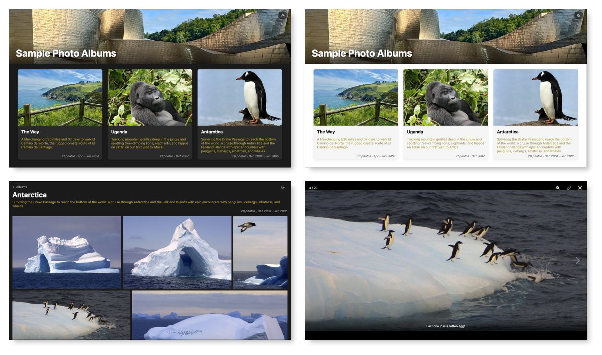

# DD Photos - Photo Album Website

[](https://github.com/dougdonohoe/ddphotos/actions)
[](https://www.gnu.org/licenses/agpl-3.0)

## Motivation

I was dissatisfied with photo sharing sites, especially Apple's iCloud shared albums,
which typically take 20+ seconds to load.  Other sites for sharing have their own 
irritations like cumbersome UIs, advertising, hawking of photo paraphernalia and
social media distractions.

I just want to share my photos with friends and family.  I want it fast, easy, mobile
friendly, and distraction free. Focus on the photos. So I built DD Photos, and it is what 
is behind [photos.donohoe.info](https://photos.donohoe.info).
It's actually pretty good, wicked fast, and meets my needs.  Maybe it will meet yours
too, which is why I've open-sourced it.

**P.S.** _I wrote about building DD Photos in [this Medium article](https://medium.com/@DougDonohoe/3b48fdd1350c?source=friends_link&sk=4094f33198de93f5488da6539c9981ee)._

## Overview

The site has a home page, with all of your albums and their description.
You can easily switch between dark and light themes.  Click/touch an album and 
you see a grid of all photos.  Click/touch a photo to see the full size version and
a caption, if it has one. You can easily swipe between photos (or use
arrow keys on a laptop).  It works great on mobile, tablet, and desktop.

Here's what it looks like on a big display (see [SCREENSHOTS.md](docs/SCREENSHOTS.md) for larger versions):



## How it Works

The idea is that you already use _something else_ to curate and filter your photos. Maybe it
is Adobe Lightroom Classic (my tool).  Or maybe it is Apple Photos or Google Photos.
It doesn't matter, but once you get a selection of photos that comprise an album,
you export the photos into a folder.  All the photos in a folder make up an album.
It's that simple.

You can create an optional `photogen.txt` file in each album folder to
define captions for each photo.  This file can also be used to define the
album's sort order, if order-by-date isn't sufficient.

With DD Photos, you define where your albums live in an `albums.yaml` file.
In a separate `descriptions.txt` you provide a short description of each album.

Once you have defined where your photos live, you run the `photogen` tool,
which resizes the photos for web viewing and generates index files that
the web app uses.

That's it.  You can now view your photo albums on your machine using the dev server.

Finally, there is a build step which creates a static site that can easily be
deployed to a machine that has a web server (like Apache or nginx) or to AWS S3.
No code runs on a server.  No database is needed.
It's just HTML, CSS, JavaScript and your (resized) photos.

## Key Features

Website features:

- Concise album cards with description, number of photos, date range and
  your choice of cover photo.
- An album's page has a nicely justified photo grid layout with PhotoSwipe lightbox that
  adjusts well to any screen size.
- Keyboard support: arrow keys navigate in lightbox, ESC key exits
  lightbox and returns to home page from album page.
- Optional per-photo descriptions via `photogen.txt`: used as image `alt` text, grid
  mouse-hover caption (desktop), always-visible caption (mobile), and lightbox caption.
- Each album has a human-readable URL (e.g., `/albums/antarctica`).
- Each photo has a shareable permalink (e.g., `/albums/patagonia/5`) accessible via a copy-to-clipboard button.
- Optional hero image: a full-width banner at the top of the home page, specified in
  `albums.yaml` with a configurable crop position (top/center/bottom).
- Optional `HTML` title, subtitle, and site overview.
- Optional password protection: encrypt individual albums or the entire site. Passwords
  are never stored server-side, decryption happens in-browser using the Web Crypto API.
  Optional hints can be shown in the password dialog. A logout button clears stored
  passwords on encrypted sites.
- Dark/light theme toggle.
- Custom CSS override: specify a CSS file in `albums.yaml` to restyle the site without
  modifying the source code.
- OpenGraph tags for rich link previews when sharing album or photo URLs on social media
  or messaging apps. The hero image (if configured) or an album cover JPEG is used as
  the preview image.

Backend features:

- Two efficient WebP image sizes created: `grid` (600px) and `full` (1600px).
- EXIF metadata extraction (dimensions, date) stored in JSON.
- All image metadata stripped from WebP output (smaller files, no GPS leak).
- Concurrent image resizing via goroutines (buffered channel, WaitGroup).
- Dry-run mode by default (use `-doit` to write files).
- Optionally use `photogen.txt` to override sort order (default is by capture date).
- Recursive album support: set `recurse: true` to collect photos from subdirectories, 
  with automatic filename prefixing to avoid collisions.
- WebP filenames for encrypted albums are HMAC-derived, preventing filename guessing
  even if the original source filename is known.

## Tech Details

The `photogen` Go program (`cmd/photogen/photogen.go`) resizes your photos to WebP
format and generates the JSON index files (`albums.json`, per-album `index.json`) 
that are consumed by the frontend.  It also generates a `sitemap.xml` file that
identifies each album.

The site (in `web`, a Node.js app) is built with SvelteKit and statically generated. 
The HTML shell and assets are pre-built files served directly by a web server, with photo data 
fetched client-side from the static JSON indexes generated by `photogen`.

There are many ways to deploy a static site like this. It is somewhat outside the scope
of this project to tackle all the various deployment strategies, but I may add more
options in the future if there is interest.

That said, I provide two deployment options out of the box: Apache via `rsync`, and
S3+CloudFront using `aws s3 sync`. Both use the same `bin/deploy-photos.sh` script, with
`--s3` selecting S3 mode. My personal site ([photos.donohoe.info](https://photos.donohoe.info))
runs on S3+CloudFront. Part of what makes the site fast is the CDN and the fact that
the site is entirely static. See [README-DEV](README-DEV.md) for AWS setup details.

## Prerequisites

The following setup instructions are Mac-centric (via [Homebrew](https://docs.brew.sh/Installation)). Linux should work with 
equivalent package manager commands (`apt`, `yum`). Windows users should use WSL2.

```bash
# Install Go, vips library and pkg-config dependency (for photogen)
brew install go vips pkg-config

# In root of this repo, fetch Go libraries
go mod download
```

The website is a Node.js app. Install
[nvm](https://github.com/nvm-sh/nvm#installing-and-updating) first if
you don't already have it.

```bash
# Install Node and dependencies (for the web app):
make web-nvm-install  # installs the Node version specified in web/.nvmrc
make web-npm-install  # install npm dependencies

# Optional: Install playwright dependencies if running e2e tests
make web-playwright-install  # installs Playwright + Chromium for e2e tests
```

You may also want to install [Docker](https://www.docker.com/get-started/) if
you don't have it, as it is required for testing site behavior using Apache or nginx.

## Sample App

Once you have the required software installed, you should be able to
build and view the sample site provided within this repo (in the `sample` dir).

```bash
# Resize photos and generate .json files
make sample-photogen

# Run dev server
make sample-npm-run-dev
```

You should see a `VITE` message and a browser window should
open at [localhost:5173](http://localhost:5173/).

To try a site with password protection and custom CSS together in one step:

```bash
make sample-demo
```

This photogens the sample site with all albums password-protected and a custom CSS
override applied, then launches the dev server. The password for the sample site is
`allgood`; the Uganda album password is `gorilla`; the Antarctica password is
`penguin`.  The CSS changes the font color
to cyan and rounds the album card corners a bit more.

You can also build the static site and test it in Apache/nginx (requires Docker and
assumes `photogen` has been run).

```bash
# Build docker image (one time)
make web-docker-build-apache
make web-docker-build-nginx

# Build sample site
make sample-build

# Run it in Docker w/ Apache/nginx
make web-docker-run-apache
make web-docker-run-nginx  
```

You should be able to see the site at [localhost:8080](http://localhost:8080).

**Congratulations!**  Now that you've got the sample site working, you can
work on your own albums.  You can start first by adding to the sample config
in `sample/config/albums.yaml`.  Or you can start building your own using the
examples in `config`.  The sections below provide details about how everything
works.

## Configuration

There are three primary configuration files involved in creating a site:

* [`albums.yaml`](config/albums.example.yaml) - **Required** - Defines your list of albums, an id for the site (useful if
  you have multiple sites), and the locations of your photos.
* [`descriptions.txt`](config/descriptions.example.txt) - **Optional** - The description of the album that you see. This
  is in a separate file to allow sharing of albums across sites (useful in development), 
  and also enables localization in the future.
* [`site.env`](config/site.example.env) - **Optional** - Environment variables for deployment and testing.

The `config` directory contains an example of each file which serves as its
detailed documentation.  The `sample/config` files are a working 
example that drives our sample photo album seen at [sample.donohoe.info](https://sample.donohoe.info).

The `config` directory is the default assumed by many commands, so feel free to put 
your config files there. Just copy the examples and edit them:

```bash
cp config/albums.example.yaml config/albums.yaml
cp config/descriptions.example.txt config/descriptions.txt
cp config/site.example.env config/site.env
```

**NOTE**: The `settings.id` value in `albums.yaml` is referred to as `<site-id>` below.
Make sure you change it to something that reflects your actual site, like `vacations` or 
`memories`.

Another option is to get yourself started is to edit the config files for the sample app.  
Or create your own config directory and use the `--config-dir` option.

## Commands

The `Makefile` is a good reference for the various DD Photos commands 
(you used them to run the sample site). Assuming you put your config files 
in `config`, these commands are useful:

### Resize and Index

```bash
# Dry run of indexing and resizing
go run cmd/photogen/photogen.go -resize -index -clean

# Do it for real
go run cmd/photogen/photogen.go -resize -index -clean -doit
```

**NOTE**: output goes to `albums/<site-id>` at the repo root by default. For example,
the sample site is in `albums/sample`.

### Run Site

Once `photogen` has been successfully run, you can run the
dev server.

```bash
DDPHOTOS_SITE_ID=<site-id> make web-npm-run-dev
```

### Build and Test with Docker

To test the build process:

```bash
DDPHOTOS_SITE_ID=<site-id> make web-npm-build
```

This deletes and recreates the `build/<site-id>` directory, which will have all
the files needed to run the site.

To run the built site using Docker, choose Apache or nginx:

```bash
DDPHOTOS_SITE_ID=<site-id> make web-docker-run-apache # Apache
DDPHOTOS_SITE_ID=<site-id> make web-docker-run-nginx  # nginx
```

You should be able to see the site at [localhost:8080](http://localhost:8080).

### Test Site

Assuming an Apache or nginx server is running, you can run the 
routing smoke tests:

```bash
make web-docker-test
```

These should pass against your site assuming you setup the `TEST_*`
variables in `site.env` to match your site.

## Developer Information

This page has the basics to get you started. See [README-DEV](README-DEV.md) for 
complete details about `photogen`, the SvelteKit site, testing, 
deployment and other technical information.

## Contributing

Contributions are welcome! Please see [CONTRIBUTING.md](CONTRIBUTING.md) for details.

## License

This project is licensed under the [GNU Affero General Public License v3.0](LICENSE.txt) (AGPL v3).

If you'd like to use this project under different terms, contact doug [at] donohoe [dot] info.
