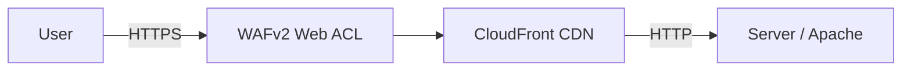
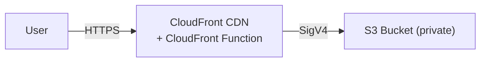

# Deployment

DD Photos supports two deployment approaches: **Apache via rsync** (for any SSH-accessible
server) and **S3 + CloudFront** (fully serverless). Both are described below.

## Syncing Logic

The web root is assembled from two independent sources:

| Source              | Contents                                                                         | Maps to             |
|---------------------|----------------------------------------------------------------------------------|---------------------|
| `build/<site-id>/`  | SvelteKit output: HTML shell, JS/CSS bundles, pre-rendered `albums/*.html` pages | web root `/`        |
| `albums/<site-id>/` | photogen output: WebP images, JSON indexes, hero images, `sitemap.xml`           | web root `/albums/` |

```
build/<site-id>/              albums/<site-id>/
  index.html                    albums.json
  albums.html                   config.json
  404.html                      hero.jpg
  robots.txt                    html.json
  *.png, *.ico                  sitemap.xml
  _app/                         antarctica/
  albums/                         cover.jpg
    antarctica.html               index.json
    hawaii.html                   full/
    albums.json  (ignored)          *.webp
    config.json  (ignored)        grid/
    html.json    (ignored)          *.webp
    antarctica/
      index.json (ignored)
         |                            |
         | Pass 1: sync -> /          | Pass 2: sync -> /albums/
         +----------------------------+
                       |
                       v
               Web root /
                 index.html    (build)
                 albums.html   (build)
                 404.html      (build)
                 robots.txt    (build)
                 *.png, *.ico  (build)
                 _app/         (build)
                 albums/
                   antarctica.html  (build)
                   hawaii.html      (build)
                   albums.json      (albums)
                   config.json      (albums)
                   hero.jpg         (albums)
                   html.json        (albums)
                   sitemap.xml      (albums)
                   antarctica/      (albums)
                     cover.jpg
                     index.json
                     full/
                       *.webp
                     grid/
                       *.webp
```

**NOTE**:  If passwords are on, you might see `albums.enc.json`, `html.enc.json`, or `index.enc.json` files.

SvelteKit copies album JSON into the build during pre-rendering, but those copies are marked
`(ignored)` — excluded by Pass 1 and replaced by the authoritative files from `albums/`.

Both sources contribute files under `/albums/` — `build/` provides the pre-rendered `.html` pages
and `albums/` provides images and JSON — so a two-pass sync is required to prevent each pass from
deleting the other's files:

- **Pass 1** (build → `/`): syncs app files; skips or protects existing `albums/` data so images
  and JSON are not deleted
- **Pass 2** (album data → `/albums/`): syncs images and JSON; skips `*.html` so pre-rendered
  album pages are not deleted

Both rsync and S3 implement this pattern, with minor differences:

|                      | rsync                                                                                                                                   | S3                                                                                                             |
|----------------------|-----------------------------------------------------------------------------------------------------------------------------------------|----------------------------------------------------------------------------------------------------------------|
| **Pass 1**           | `--filter='protect albums/**'` preserves album data on the server                                                                       | `--exclude "albums/*" --include "albums/*.html"` uploads only `.html` from `albums/`                           |
| **Pass 2**           | `--exclude=*.html` skips pre-rendered pages                                                                                             | Two sub-passes: one for JSON/XML/covers (`Cache-Control: no-cache`), one for WebP (`Cache-Control: immutable`) |
| **Change detection** | Pass 1 uses `--checksum` (Vite resets timestamps every build); Pass 2 uses size+time (photogen preserves timestamps on unchanged files) | Size+time only (no checksum option in `aws s3 sync`)                                                           |

The local Docker testing environment uses the same separation: `web/setup-htdocs.sh` symlinks
build output into `htdocs/` and album data into `htdocs/albums/` from separate bind mounts,
mirroring the two-source structure without transferring any files.

## Apache + rsync

In this scenario, traffic is handled by CloudFront, which filters
requests through a WAFv2 web ACL before forwarding clean traffic to an Apache
origin on any SSH-accessible server.



The WAF (Web Application Firewall) inspects every incoming request and blocks
suspicious or malicious traffic (things like bots or known bad IP addresses)
before it ever reaches the origin server.

The CDN (Content Delivery Network) caches content at edge locations around
the world so visitors get fast load times regardless of where they are,
and the origin server handles far less traffic.

The site is rsynced to the origin server; CloudFront caches and serves it to visitors.

## S3 + CloudFront

An alternative is to serve the site entirely from S3 and CloudFront — no server
required. Site files live in a private S3 bucket; CloudFront serves them using a
signed-request mechanism called OAC (Origin Access Control).



### AWS Components

Several AWS components are needed to serve an S3-based site:

| Component                       | Purpose                                                                                                                               |
|---------------------------------|---------------------------------------------------------------------------------------------------------------------------------------|
| **S3 bucket**                   | Stores all site files. Must be private — no public access block overrides.                                                            |
| **Origin Access Control (OAC)** | Lets CloudFront sign requests to S3 using SigV4. Required because the bucket is private.                                              |
| **S3 bucket policy**            | Grants the OAC principal `s3:GetObject` on the bucket. Without this, CloudFront gets a `403` even with OAC.                           |
| **ACM certificate**             | TLS certificate for your domain. Must be provisioned in `us-east-1` — CloudFront requires this regardless of where your bucket lives. |
| **CloudFront distribution**     | CDN that serves from S3 via OAC. Requires custom error responses (see below).                                                         |
| **CloudFront Function**         | Lightweight JavaScript function (viewer-request stage) that handles URL routing. See below.                                           |
| **DNS**                         | CNAME or alias record pointing your domain to the CloudFront distribution domain name.                                                |

**Custom error responses:** A private S3 bucket returns `403 Forbidden` (not `404`) for keys that
don't exist — returning `404` would confirm the key's absence and enable bucket enumeration.
Your CloudFront distribution must map both `403` and `404` to `/404.html` with a `404` response code,
or users will see a raw XML error from S3 instead of your custom 404 page.

### CloudFront Function

A CloudFront Function at the **viewer-request** stage handles URL routing in place of a web
server config file. See [Web Server Configuration](DEPLOYMENT-SERVERS.md#cloudfront-function)
for the function code.

## Prerequisites

A `config/site.env` with your rsync or S3 credentials is required before deploying in
either mode — see [site.env](CONFIGURATION.md#siteenv) for examples.

## Deploying — Docker Mode

```bash
ddphotos deploy
```

Docker mode is intentionally simple and prescriptive. It:

1. Detects S3 or rsync automatically — if `S3_BUCKET` is set in `config/site.env`, S3 mode is used; otherwise rsync
2. Validates that `photogen` and `build` have been run and are up to date — exits with an error if not
3. Syncs the site (two-pass, as described in [Syncing Logic](#syncing-logic) above)
4. Invalidates the CloudFront cache via `$CLOUDFRONT_ID` (skipped if not set)
5. Runs `bin/test-photos-server.sh` to verify the deployment against production

Pre-deploy tests and Playwright are skipped — run `ddphotos photogen` and `ddphotos build` before deploying.

## Deploying — Developer Mode

`bin/deploy-photos.sh` handles both S3 and rsync modes. Add `--s3` for S3 mode.

1. Runs `photogen` to resize images and generate JSON
2. Builds the static site via `npm run build` into `build/<site-id>/`
3. *(rsync mode only)* Starts Docker/Apache, runs `bin/test-photos-server.sh --local` to verify
   routing locally, runs Playwright tests against Docker/Apache, then stops the container
4. Deploys the site:
   - **S3**: two-pass `aws s3 sync` — pass 1 syncs the build output (excluding `albums/*` but
     re-including `albums/*.html`); pass 2 syncs album images and JSON (`--size-only`, excluding
     `*.html`). The two-pass approach keeps app files and photo data independent.
   - **rsync**: two-pass `rsync` — pass 1 uses `--checksum` (Vite resets timestamps on every build);
     pass 2 syncs album data independently.
5. Invalidates the CloudFront cache via `$CLOUDFRONT_ID` (skipped if not set)
6. Runs `bin/test-photos-server.sh` to verify the deployment against production
7. Runs Playwright tests against production (URL read from `config.json`)

The script uses `set -eo pipefail` — any failure aborts before deployment.

### Flags

| Flag                    | Description                                                                                                             |
|-------------------------|-------------------------------------------------------------------------------------------------------------------------|
| `--s3`                  | Deploy to S3 instead of rsync (requires `S3_BUCKET` in `site.env`; skips pre-deploy Docker/Apache and Playwright tests) |
| `--dry-run`             | Pass `--dry-run`/`--dryrun` to rsync or `aws s3 sync`; skips CloudFront invalidation and post-deploy tests              |
| `--no-photogen`         | Skip photo generation step                                                                                              |
| `--no-build`            | Skip the static site build step                                                                                         |
| `--no-rsync`            | Skip deploy, CloudFront invalidation, and post-deploy tests (build + local test only)                                   |
| `--no-pre-deploy-tests` | Skip pre-deploy Docker/Apache test and Playwright (rsync mode only); post-deploy tests still run                        |
| `--no-server-test`      | Skip both the local and post-deploy server routing tests                                                                |
| `--no-playwright`       | Skip Playwright tests (both local and production)                                                                       |
| `--config-dir`          | Directory containing `albums.yaml`, `descriptions.txt`, and (by default) `site.env`                                     |
| `--site-env`            | Path to `site.env` — overrides `--config-dir/site.env` when the two live in different locations                         |

```bash
# S3 mode
bin/deploy-photos.sh --s3                          # full S3 deploy
bin/deploy-photos.sh --s3 --dry-run                # preview what s3 sync would transfer, no changes made
bin/deploy-photos.sh --s3 --no-photogen            # skip photo generation

# rsync mode
bin/deploy-photos.sh                               # full deploy
bin/deploy-photos.sh --dry-run                     # preview what rsync would transfer, no changes made
bin/deploy-photos.sh --no-photogen                 # skip photo generation
bin/deploy-photos.sh --no-rsync                    # build + local test only (safe on a dev machine)
bin/deploy-photos.sh --no-photogen --no-rsync      # build + local test, skip both photogen and rsync
```
