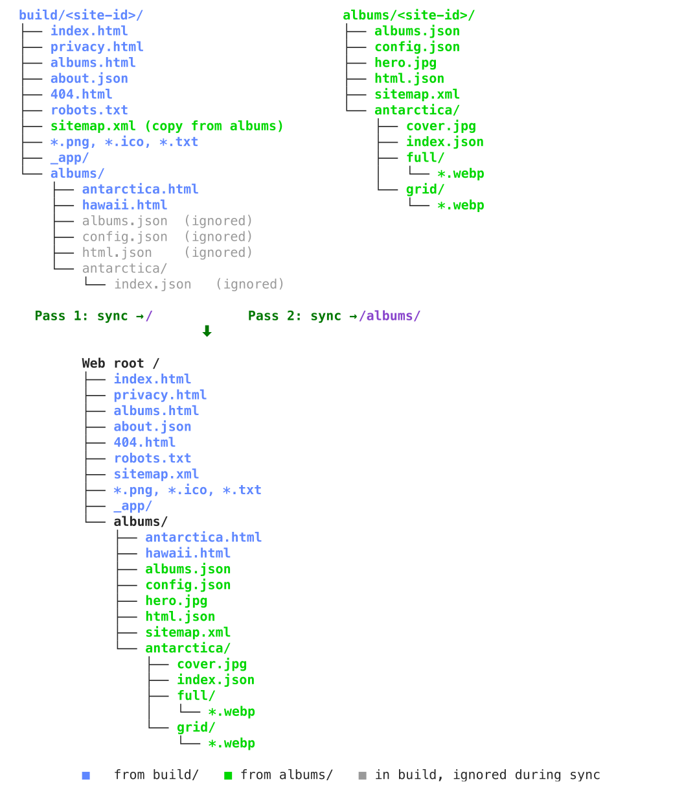
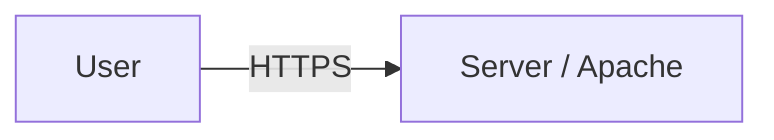
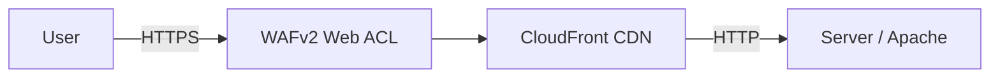
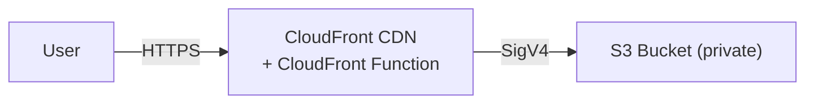

# Deployment

DD Photos supports the following deployment approaches:

 * **Static** - via `export` script (for any compatible static-hosting service, e.g., [Surge↗](https://surge.sh), [Cloudflare Pages↗](https://pages.cloudflare.com))
 * **Apache via rsync** - via `deploy` script (for any SSH-accessible server)
 * **S3 + CloudFront** - via `deploy` script (fully serverless).

All are described below.

## Syncing Logic

It is important to understand that the web root is assembled from two independent sources:

| Source              | Contents                                                                         | Maps to             |
|---------------------|----------------------------------------------------------------------------------|---------------------|
| `build/<site-id>/`  | SvelteKit output: HTML shell, JS/CSS bundles, pre-rendered `albums/*.html` pages | web root `/`        |
| `albums/<site-id>/` | photogen output: WebP images, JSON indexes, hero images, `sitemap.xml`           | web root `/albums/` |



**NOTE**:  If passwords are on, you might see `albums.enc.json`, `html.enc.json`, or `index.enc.json` files.

SvelteKit copies album JSON into the build during pre-rendering, but those copies are marked
`(ignored)` — excluded by Pass 1 and replaced by the authoritative files from `albums/`.

Both sources contribute files under `/albums/` — `build/` provides the pre-rendered `.html` pages
and `albums/` provides images and JSON — so a two-pass sync is required to prevent each pass from
deleting the other's files:

- **Pass 1** (build → `/`): syncs app files; skips or protects existing `albums/` data so images
  and JSON are not deleted
- **Pass 2** (album data → `/albums/`): syncs images and JSON; skips `*.html` so pre-rendered
  album pages are not deleted

Both rsync and S3 implement this pattern, with minor differences:

|                      | rsync                                                                                                                                   | S3                                                                                                             |
|----------------------|-----------------------------------------------------------------------------------------------------------------------------------------|----------------------------------------------------------------------------------------------------------------|
| **Pass 1**           | `--filter='protect albums/**'` preserves album data on the server                                                                       | `--exclude "albums/*" --include "albums/*.html"` uploads only `.html` from `albums/`                           |
| **Pass 2**           | `--exclude=*.html` skips pre-rendered pages                                                                                             | Two sub-passes: one for JSON/XML/covers (`Cache-Control: no-cache`), one for WebP (`Cache-Control: immutable`) |
| **Change detection** | Pass 1 uses `--checksum` (Vite resets timestamps every build); Pass 2 uses size+time (photogen preserves timestamps on unchanged files) | Size+time only (no checksum option in `aws s3 sync`)                                                           |

The `export` command uses the same logic (in `web/setup-htdocs.sh`) to produce `export/<site-id>/` — a self-contained
directory of symlinks suitable for local serving (`python3 -m http.server`) or uploading to
a static hosting service. Use `--copy` to resolve symlinks to real files for services that
don't follow them (e.g. Surge); Cloudflare Pages follows symlinks so `--copy` is not required
there. See [Local Testing with Python](DEPLOYMENT-SERVERS.md#local-testing-with-python) for Python limitations.

The local Docker testing environment uses the same separation: `web/setup-htdocs.sh` symlinks
build output into `htdocs/` and album data into `htdocs/albums/` from separate bind mounts,
mirroring the two-source structure without transferring any files.

## Static Deployment

Static deployment typically works by copying a single folder which represents the HTML root. The `export` command
is used to create a root from the source `album` and `build` dirs.

### Docker Mode

```bash
./ddphotos photogen
./ddphotos build
./ddphotos export        # uses symlinks
./ddphotos export --copy # do not use symlinks
```

After running `export`, you'll see an `export/<site-id>` folder which you can sync to your static site service.

### Developer Mode

Use the `bin/export.sh` script:

```bash
export.sh --site-id <site-id>
export.sh --site-id <site-id> --copy
```

### Surge

[Surge↗](https://surge.sh) is a simple, free alternative for hosting static sites. It works well with DD Photos sites.

Assuming you have `surge` installed (`npm install --global surge`), in Docker mode:

```bash
./ddphotos export --copy
./surge --domain my-unique-site.surge.sh export/my-photos
```

In developer mode:

```bash
export.sh --site-id <site-id> --copy
./surge --domain my-unique-site.surge.sh export/<site-id>
```

The site will be at https://my-unique-site.surge.sh.

See [Surge](DEPLOYMENT-SERVERS.md#surge) for routing behavior and known limitations.

### Cloudflare Pages

[Cloudflare Pages↗](https://pages.cloudflare.com) is a free static hosting service with
unlimited bandwidth. Photo permalink routing requires a `_worker.js` — use `--cloudflare`
instead of `--copy` to generate it automatically (symlinks are followed, so `--copy` is
not needed).

Assuming you have `wrangler` installed (`npm install -g wrangler --ignore-scripts`), in Docker mode:

```bash
./ddphotos export --cloudflare
wrangler pages deploy --project-name my-unique-site export/my-photos
```

In developer mode:

```bash
export.sh --site-id <site-id> --cloudflare
wrangler pages deploy --project-name my-unique-site export/<site-id> 
```

The first deploy creates the project automatically and assigns a URL of
`https://my-unique-site.pages.dev`. See [Cloudflare Pages Worker](DEPLOYMENT-SERVERS.md#cloudflare-pages-worker)
for how routing works.

## Apache + rsync

In this scenario, the site is rsynced to any SSH-accessible server running Apache.
That's the only hard requirement.



Optionally, you can place CloudFront (and a WAFv2 web ACL) in front of the origin:



The CDN (Content Delivery Network) caches content at edge locations around the world
so visitors get fast load times regardless of where they are, and the origin server
handles far less traffic.

The WAF (Web Application Firewall) inspects every incoming request and blocks suspicious
or malicious traffic (bots, known bad IPs, common attack patterns) before it reaches the
origin. Adding a WAF is recommended whenever the server is internet-facing — it's the
first line of defense against automated abuse.

If `CLOUDFRONT_ID` is set in `config/site.env`, the deploy script automatically
invalidates the CloudFront cache after each deploy.

## S3 + CloudFront

An alternative is to serve the site entirely from S3 and CloudFront — no server
required. Site files live in a private S3 bucket; CloudFront serves them using a
signed-request mechanism called OAC (Origin Access Control).



### AWS Components

Several AWS components are needed to serve an S3-based site:

| Component                       | Purpose                                                                                                                               |
|---------------------------------|---------------------------------------------------------------------------------------------------------------------------------------|
| **S3 bucket**                   | Stores all site files. Must be private — no public access block overrides.                                                            |
| **Origin Access Control (OAC)** | Lets CloudFront sign requests to S3 using SigV4. Required because the bucket is private.                                              |
| **S3 bucket policy**            | Grants the OAC principal `s3:GetObject` on the bucket. Without this, CloudFront gets a `403` even with OAC.                           |
| **ACM certificate**             | TLS certificate for your domain. Must be provisioned in `us-east-1` — CloudFront requires this regardless of where your bucket lives. |
| **CloudFront distribution**     | CDN that serves from S3 via OAC. Requires custom error responses (see below).                                                         |
| **CloudFront Function**         | Lightweight JavaScript function (viewer-request stage) that handles URL routing. See below.                                           |
| **DNS**                         | CNAME or alias record pointing your domain to the CloudFront distribution domain name.                                                |

**Custom error responses:** A private S3 bucket returns `403 Forbidden` (not `404`) for keys that
don't exist — returning `404` would confirm the key's absence and enable bucket enumeration.
Your CloudFront distribution must map both `403` and `404` to `/404.html` with a `404` response code,
or users will see a raw XML error from S3 instead of your custom 404 page.

### CloudFront Function

A CloudFront Function at the **viewer-request** stage handles URL routing in place of a web
server config file. See [Web Server Configuration](DEPLOYMENT-SERVERS.md#cloudfront-function)
for the function code.

## Prerequisites

A `config/site.env` with your rsync or S3 credentials is required before deploying in
either mode — see [site.env](CONFIGURATION.md#siteenv) for examples.

**Rsync mode** also requires a valid SSH key in `~/.ssh` with access to the target host.
In Docker mode, `~/.ssh` is mounted into the container automatically if the directory exists.

**S3 mode** requires AWS credentials — either via `~/.aws` config files or environment variables
(`AWS_PROFILE`, `AWS_DEFAULT_PROFILE`, `AWS_DEFAULT_REGION`, `AWS_REGION`,
`AWS_ACCESS_KEY_ID`, `AWS_SECRET_ACCESS_KEY`, `AWS_SESSION_TOKEN`).
In Docker mode, `~/.aws` is mounted and any of those environment variables that are set
are forwarded into the container automatically.

## Deploying — Docker Mode

```bash
ddphotos deploy
```

Docker mode is intentionally simple and prescriptive. It:

1. Detects S3 or rsync automatically — if `S3_BUCKET` is set in `config/site.env`, S3 mode is used; otherwise rsync
2. Validates that `photogen` and `build` have been run and are up to date — exits with an error if not
3. Syncs the site (two-pass, as described in [Syncing Logic](#syncing-logic) above)
4. Invalidates the CloudFront cache via `$CLOUDFRONT_ID` (skipped if not set)
5. Runs `bin/test-photos-server.sh` to verify the deployment against production

Pre-deploy tests and Playwright are skipped — run `ddphotos photogen` and `ddphotos build` before deploying.

## Deploying — Developer Mode

`bin/deploy-photos.sh` handles both S3 and rsync modes. Add `--s3` for S3 mode.

1. Runs `photogen` to resize images and generate JSON
2. Builds the static site via `npm run build` into `build/<site-id>/`
3. *(rsync mode only)* Starts Docker/Apache, runs `bin/test-photos-server.sh --local` to verify
   routing locally, runs Playwright tests against Docker/Apache, then stops the container
4. Deploys the site:
   - **S3**: two-pass `aws s3 sync` — pass 1 syncs the build output (excluding `albums/*` but
     re-including `albums/*.html`); pass 2 syncs album images and JSON (`--size-only`, excluding
     `*.html`). The two-pass approach keeps app files and photo data independent.
   - **rsync**: two-pass `rsync` — pass 1 uses `--checksum` (Vite resets timestamps on every build);
     pass 2 syncs album data independently.
5. Invalidates the CloudFront cache via `$CLOUDFRONT_ID` (skipped if not set)
6. Runs `bin/test-photos-server.sh` to verify the deployment against production
7. Runs Playwright tests against production (URL read from `config.json`)

The script uses `set -eo pipefail` — any failure aborts before deployment.

### Flags

| Flag                    | Description                                                                                                             |
|-------------------------|-------------------------------------------------------------------------------------------------------------------------|
| `--s3`                  | Deploy to S3 instead of rsync (requires `S3_BUCKET` in `site.env`; skips pre-deploy Docker/Apache and Playwright tests) |
| `--dry-run`             | Pass `--dry-run`/`--dryrun` to rsync or `aws s3 sync`; skips CloudFront invalidation and post-deploy tests              |
| `--no-photogen`         | Skip photo generation step                                                                                              |
| `--no-build`            | Skip the static site build step                                                                                         |
| `--no-rsync`            | Skip deploy, CloudFront invalidation, and post-deploy tests (build + local test only)                                   |
| `--no-pre-deploy-tests` | Skip pre-deploy Docker/Apache test and Playwright (rsync mode only); post-deploy tests still run                        |
| `--no-server-test`      | Skip both the local and post-deploy server routing tests                                                                |
| `--no-playwright`       | Skip Playwright tests (both local and production)                                                                       |
| `--config-dir`          | Directory containing `albums.yaml`, `descriptions.txt`, and (by default) `site.env`                                     |
| `--site-env`            | Path to `site.env` — overrides `--config-dir/site.env` when the two live in different locations                         |

```bash
# S3 mode
bin/deploy-photos.sh --s3                          # full S3 deploy
bin/deploy-photos.sh --s3 --dry-run                # preview what s3 sync would transfer, no changes made
bin/deploy-photos.sh --s3 --no-photogen            # skip photo generation

# rsync mode
bin/deploy-photos.sh                               # full deploy
bin/deploy-photos.sh --dry-run                     # preview what rsync would transfer, no changes made
bin/deploy-photos.sh --no-photogen                 # skip photo generation
bin/deploy-photos.sh --no-rsync                    # build + local test only (safe on a dev machine)
bin/deploy-photos.sh --no-photogen --no-rsync      # build + local test, skip both photogen and rsync
```
